# GraphicsProject
Programming framework for Computer Graphics course at DIKU

## Installing on Mac OS 10.13.6

Remark: Current version numbers we used are shown. The framework may work with other versions.

We used MacPorts (https://www.macports.org/) to install third party dependencies. Afer having installed macport then open a terminal and do write as follows

```console  
  sudo port install glew @2.1.0_0
  sudo port install glfw @3.2.1_0+docs
  sudo port install glm @0.9.9.0_0
```

We downloaded CMake ver 3.13.1 from (https://cmake.org/) and installed this.

* Open up CMake gui
* Browse to source folder that contains top-level CMakeLists.txt file
* Specify a folder where to build the binaries. IMPORTANT: Keep binary tree separate from source tree. See figure below for illustration

<center>
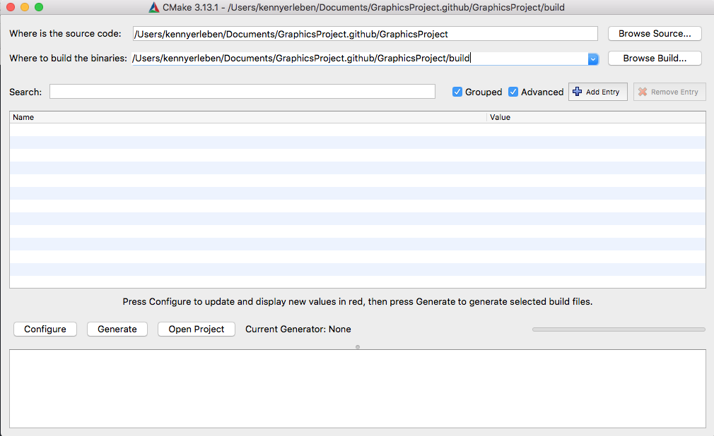
</center>

* Click configure

<center>
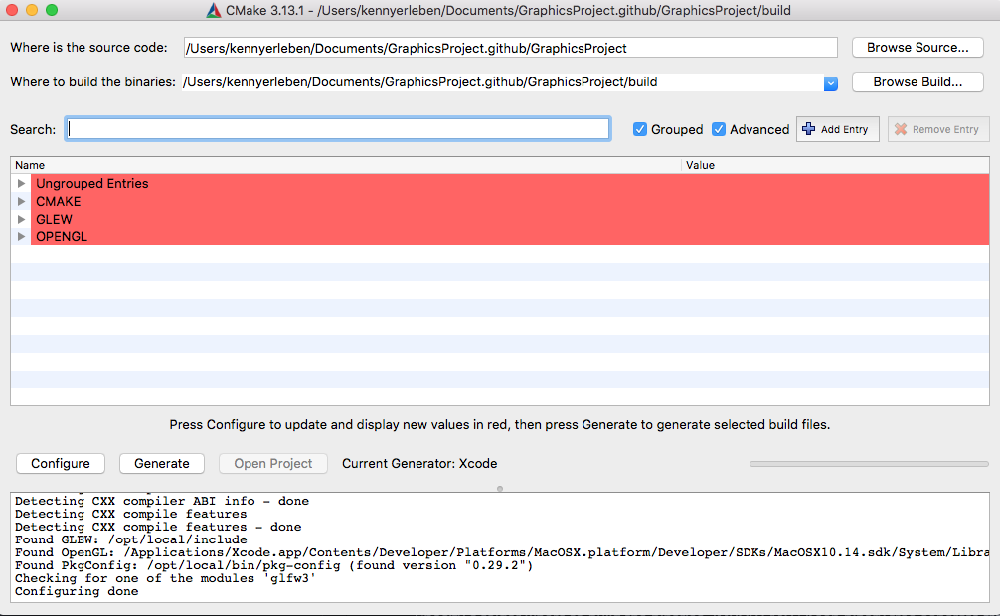
</center>

* Inspect CMake variables to see if you need to specify anything
* Click configure until no pink entries are shown

<center>
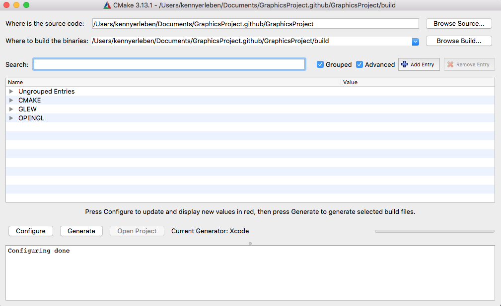
</center>

* Click generate

<center>
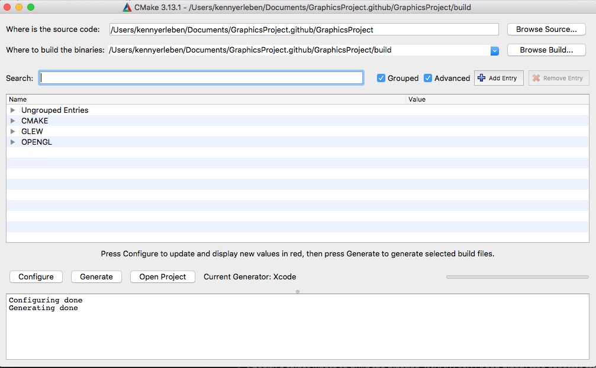
</center>

* Click open project, you should see your IDE open op.

<center>
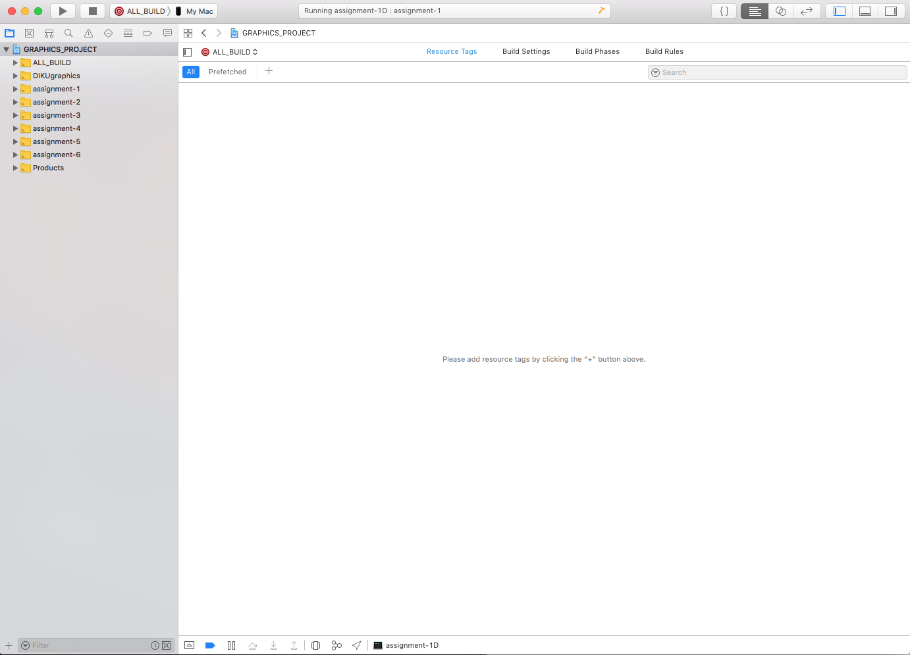
</center>

Finally you can build all using your favourite IDE environment

## Installing on Windows

Remark: The framework may work with other versions than what is used below.

For our Windows installation we will be using Visual Studio as our compiler and IDE, and Vcpkg as our library manager. Codeblocks or another compiler/IDE should be just as viable as Visual Studio, however the following procedure has yet to be tested with anything but Visual Studio.

The following is done in Windows 10 with Visual Studio 2017 and Windows PowerShell.

Before continuing ensure that git and a version of Visual Studio is installed. If you have not already done so, download/clone this project to your machine.


#### Vcpkg

Use the 'Quick Start' guide on  https://github.com/Microsoft/vcpkg to install Vcpkg.


#### GLEW, GLFW & GLM

When Vcpkg is installed, navigate to the root folder of Vcpkg and run the following three commands:

```console  
.\vcpkg.exe install glfw3
.\vcpkg.exe install glew
.\vcpkg.exe install glm
```

At the time of writing the latest versions of these packages are 3.3-3, 2.1.0-6 and 0.9.9.5-3, respectively.

Use the ``.\vcpkg.exe list `` command to ensure that these three packages are properly installed. The result of the command should look something like this:

<center>
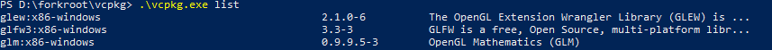
</center>

#### CMake

We downloaded CMake ver 3.15.5 from (https://cmake.org/) and installed this via
the installer.

* Open up CMake gui
* Browse to the source folder that contains the top-level CMakeLists.txt file (./GraphicsFolder/)
* Specify a folder where to build the binaries. IMPORTANT: Keep binary tree separate from source tree. We create a ./GraphicsFolder/Build folder for our binaries. See image below for illustration:

<center>
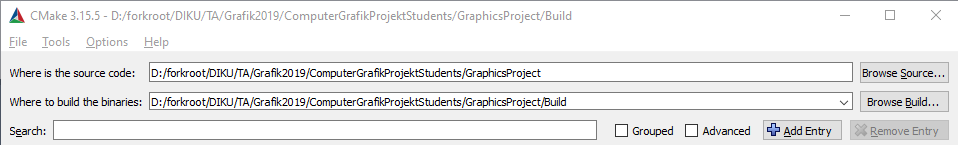
</center>

* Click 'Configure' once. This will prompt a window where you must select a generator. We choose the 'Visual Studio 15 2017' option. You need to select an option that matches your installed compiler/IDE. After selecting a generator, ensure that 'Specify toolchain file for cross-compiling' is selected as seen in the image below:

<center>
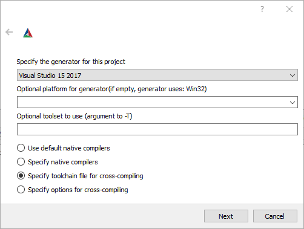
</center>

* Click 'Next' and specify the full path to the '...\vcpkg\scripts\buildsystems\vcpkg.cmake' file as shown in the image below:

<center>
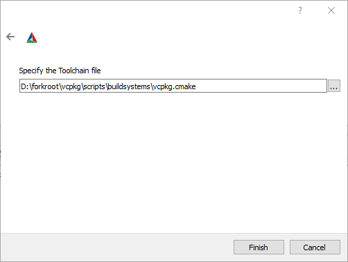
</center>

* Click 'Finish' and the configuration process will automatically start. There should be no configuration left to be done and everything should be setup properly now. Should there still be configuration left to be done, then do so now, before clicking 'Configure' again.

* Once the configuration has succeeded, click 'Generate'.

* Upon generation success click 'Open Project' to open the project in Visual Studio.

Use Visual Studio to build the project to ensure that everything is setup properly. If build errors occur please revise the above steps.

You are now good to go!


#### Running the project

You should now have a solution with name 'GRAPHICS_PROJECT' and several targets as shown in the image below:

<center>
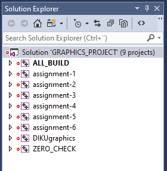
</center>

To change target right click any of the 'assignment-X' subprojects and click 'Set as StartUp Project'. The active subproject is the one in bold. When changed to any of the assignment projects run the project by clicking 'Local Windows Debugger' in Visual Studio as shown below:

<center>
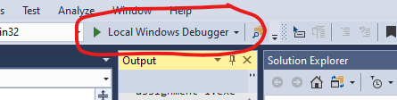
</center>


## Installing on Linux

To be done
